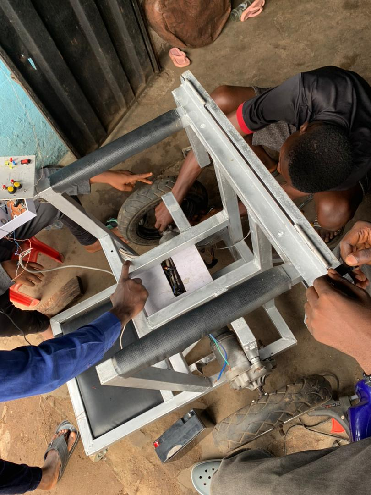
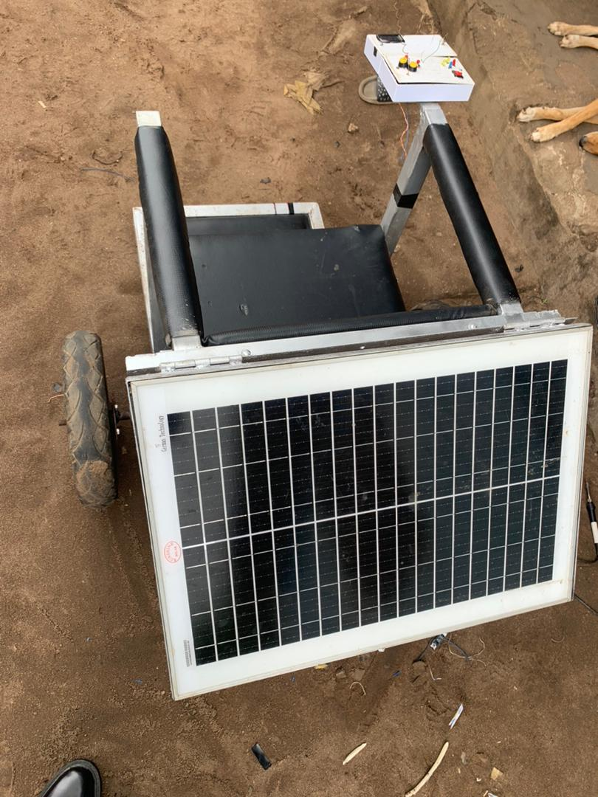
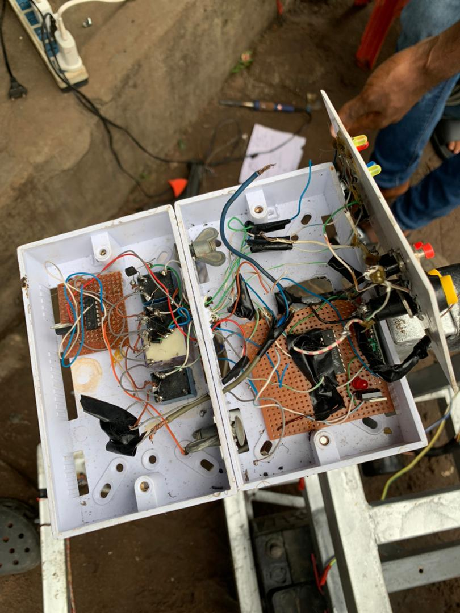
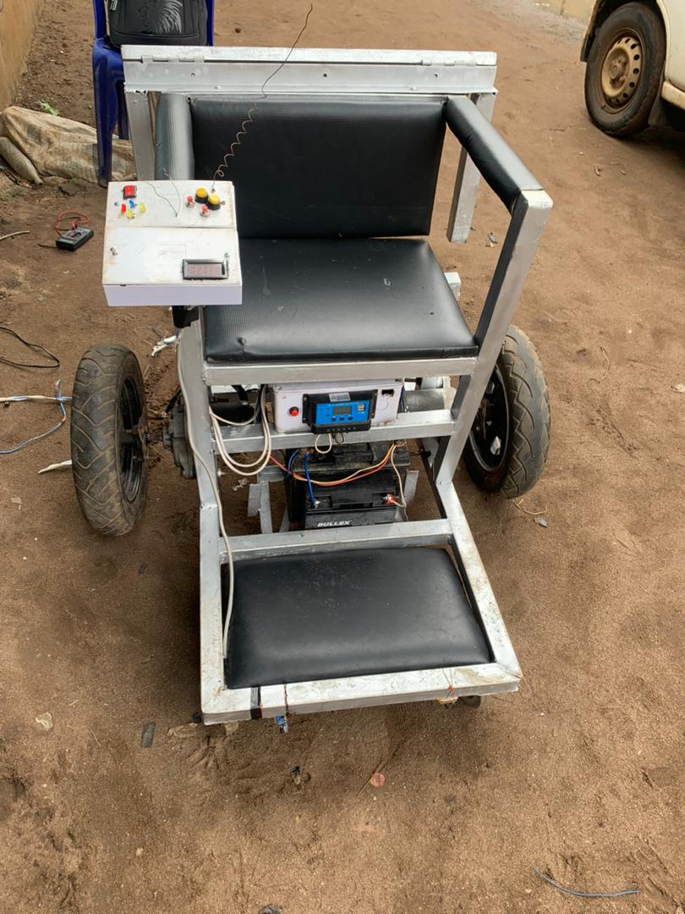

# ♿ Smart Solar-Powered Wheelchair

<p align="center">
  
  
  
  
  
</p>

<p align="center">
  <b>A solar-powered, Arduino-based intelligent wheelchair featuring obstacle avoidance and three independent control modes — built to promote independence and inclusion for physically impaired individuals.</b>
</p>

---

## 📌 Project Overview

Access to mobility aids that are affordable, intelligent, and energy-independent remains a significant challenge in many communities. This project was developed as a final-year undergraduate engineering project at the Federal University of Technology, Owerri (FUTO), with the goal of addressing that challenge directly.

The Smart Solar-Powered Wheelchair combines renewable energy, embedded systems, and multi-modal control into a single assistive device. It runs entirely off-grid using solar energy, requires no fuel or external charging infrastructure, and gives users three flexible ways to operate it — voice commands, an IR remote, or a physical push button — all with integrated obstacle detection to prevent collisions.

The project was successfully built, tested, and defended before a panel of academic supervisors and engineers, demonstrating both technical viability and real-world impact in assistive technology.

---

## 🖼️ Project Gallery

<p align="center">
  
  &nbsp;
  
</p>
<p align="center">
  <em>Left: Completed prototype &nbsp;|&nbsp; Right: Solar panel and battery integration</em>
</p>

<p align="center">
  
  &nbsp;
  
</p>
<p align="center">
  <em>Left: Arduino Nano, IR sensors, and wiring &nbsp;|&nbsp; Right: Team defense at FUTO</em>
</p>

---

## ✨ Key Features

- **Off-Grid Solar Power** — 22V, 80W solar panel with 24V battery — fully energy-independent
- **Intelligent Obstacle Avoidance** — IR sensor blocks forward movement when an obstacle is detected
- **Three Control Modes** — Voice, Remote (IR), and Push-Button
- **Arduino Nano Core** — Lightweight embedded controller managing all inputs and outputs
- **Real-Time Sensor Processing** — Obstacle detection active across all control modes simultaneously

---

## 🏗️ System Architecture

```
┌─────────────────────────────────────────────────────┐
│                  POWER SYSTEM                       │
│   Solar Panel (22V, 80W) → Battery (24V) → Motors  │
└─────────────────────────────────────────────────────┘
              │
              ▼
┌─────────────────────────────────────────────────────┐
│              CONTROL SYSTEM (Arduino Nano)          │
│                                                     │
│   Input Sources:                                    │
│   ├── Voice Recognition Module (SoftwareSerial)    │
│   ├── IR Remote Receiver (Pin 11)                  │
│   ├── Push-Button (Pin 9, INPUT_PULLUP)            │
│   └── IR Obstacle Sensor (Pin 8)                   │
│                                                     │
│   Output:                                           │
│   └── Motor Driver → Left & Right DC Motors        │
│       (Pins 4, 5, 6, 7)                            │
└─────────────────────────────────────────────────────┘
```

---

## 🎮 Control Modes

### 1. Push-Button Mode
Simple manual control. Press to move forward. If the IR sensor detects an obstacle, forward motion is blocked automatically.

### 2. Voice Control Mode
Hands-free operation via Voice Recognition V3 module:

| Voice Command | Action |
|--------------|--------|
| "Forward" | Move forward (if no obstacle) |
| "Backward" | Move backward |
| "Left" | Turn left |
| "Right" | Turn right |
| "Stop" | Halt all motors |

### 3. Remote Control Mode (IR)

| Remote Button | IR Code | Action |
|--------------|---------|--------|
| Up | `0xFF629D` | Move forward (if no obstacle) |
| Down | `0xFFA857` | Move backward |
| Left | `0xFF22DD` | Turn left |
| Right | `0xFFC23D` | Turn right |
| OK | `0xFF02FD` | Stop |

### Obstacle Avoidance (All Modes)
The IR obstacle sensor runs continuously across all control modes. Forward motion is automatically blocked whenever an obstacle is detected — this safety layer cannot be overridden.

---

## 🔧 Hardware Components

| Component | Specification | Purpose |
|-----------|--------------|---------|
| Arduino Nano | ATmega328P, 16MHz | Main controller |
| Solar Panel | 22V, 80W | Primary power source |
| Battery | 24V | Energy storage |
| IR Obstacle Sensor | Digital output | Collision prevention |
| Voice Recognition Module V3 | SoftwareSerial (Pins 2, 3) | Voice input |
| IR Receiver | Pin 11 | Remote control input |
| DC Motor Driver | H-Bridge | Bidirectional motor control |
| DC Motors (×2) | Left & Right | Wheelchair locomotion |
| Push Button | Pin 9, INPUT_PULLUP | Manual control |
| Wheelchair Frame | Standard manual frame | Structural base |

---

## 📋 Pin Configuration

```cpp
// Motor control
int motorLeftForward   = 4;
int motorLeftBackward  = 5;
int motorRightForward  = 6;
int motorRightBackward = 7;

// Input
int irSensor   = 8;   // IR obstacle sensor
int buttonPin  = 9;   // Push-button
int RECV_PIN   = 11;  // IR remote receiver

// Voice module (SoftwareSerial)
VR myVR(2, 3);        // RX=2, TX=3
```

---

## ⚙️ How to Set Up & Run

### Prerequisites
- [Arduino IDE](https://www.arduino.cc/en/software) (v1.8+ or v2.x)
- Arduino Nano board
- Libraries: `IRremote`, `VoiceRecognitionV3`, `SoftwareSerial`

### Steps

**1. Clone the repository**
```bash
git clone https://github.com/MaxCybOps/Smart-Solar-Wheelchair.git
cd Smart-Solar-Wheelchair
```

**2. Install libraries**
In Arduino IDE → Sketch → Include Library → Manage Libraries:
- Search and install **IRremote** by z3t0
- Search and install **VoiceRecognitionV3** by elechouse

**3. Open, wire, and upload**
- Open `wheelchair.ino` in Arduino IDE
- Wire components per pin configuration above
- Select **Tools → Board → Arduino Nano** and correct COM port
- Click **Upload**

---

## ⚡ Power System

```
Solar Panel (22V, 80W)
        │
        ▼
  Charge Controller
        │
        ▼
   Battery (24V)
        │
   ┌────┴────┐
   ▼         ▼
Arduino    Motor Driver
  Nano      (DC Motors)
```

The solar panel charges the 24V battery during daylight. The battery provides stable power to both the Arduino Nano and the motor driver, allowing operation even in low-light conditions.

---

## 🚧 Challenges & Engineering Solutions

| Challenge | Solution |
|-----------|----------|
| Power stability across components | Voltage regulation between solar panel, battery, and Arduino |
| Control mode switching conflicts | Debugged Arduino logic to prevent simultaneous mode activation |
| Budget constraints | Optimized component selection for affordability |
| Obstacle detection latency | Tuned sensor polling frequency for near-instant response |
| Team coordination (11 engineers) | Divided subsystems with regular integration testing |

---

## 🔭 Future Improvements

1. **ROS 2 Integration** — Advanced autonomous navigation and path planning
2. **Live Monitoring Dashboard** — Real-time UI for battery, speed, and obstacle status
3. **AI-Based Obstacle Detection** — Computer vision replacing IR for richer awareness
4. **GPS Tracking** — Location monitoring for caregiver awareness
5. **Mobile App Control** — Bluetooth/WiFi smartphone control
6. **Battery Health Monitoring** — Alerts for low charge and solar performance

---

## 👥 Team & Supervision

Developed by a team of **11 Mechatronics Engineering students** at FUTO, under the supervision of **Engr. Dr. V. O. Aniugo**. Successfully presented and defended before an engineering review panel.

---

## 👨‍💻 Author

**Ogbodo Uchenna Maxwell Adrian**
- 🔗 GitHub: [@MaxCybOps](https://github.com/MaxCybOps)
- 💼 LinkedIn: [uchenna-ogbodo-5bb270235](https://linkedin.com/in/uchenna-ogbodo-5bb270235)
- 📧 Email: ogbodomaxwell23@gmail.com

---

## 📄 License

Licensed under the **MIT License** — see [LICENSE](LICENSE) for details.

---

<p align="center">
  <i>Built with purpose — engineering solutions that improve lives.</i><br/>
  <i>If you found this useful, consider starring ⭐ the repository.</i>
</p>
